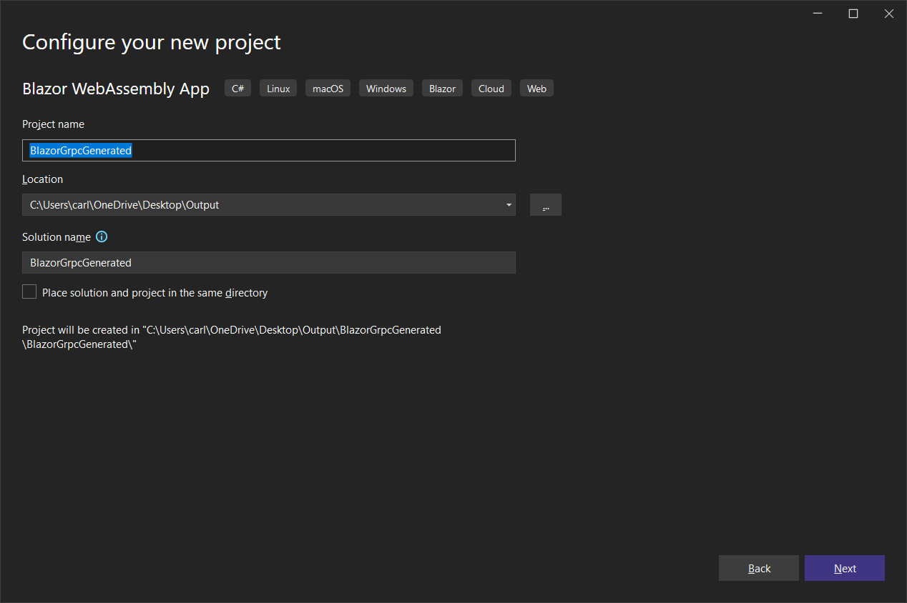
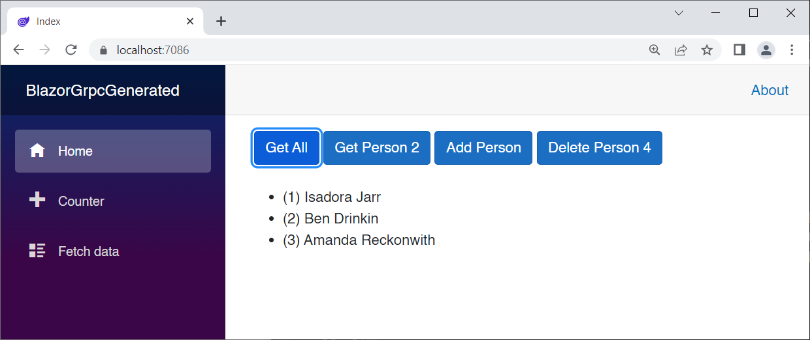

# GrpcGenerator

GrpcGenerator is a .NET Core 7 console app that demonstrates the **GrpcWizard** library, which generates a complete gRPC infrastructure for a hosted Blazor WebAssembly application from a simple service and an interface. Each method in the service must define an input type and return a Task of an output type. 

You will end up with a client-side service that uses .NET types.

Conversion to and from gRPC message types is done automatically.

The wizard will generate:

- a proto file
- converter class files to convert gRPC message types to .NET class types and vice-versa
- one or more gRPC server-side services that call into your c# service 
- client-side services that calls the gRPC service, converting types automatically
- a README.txt file with instructions, markup, and code to add to your projects

## Why do we need this?

Why do we need a code generator for a code generator? gRPC for .NET ***is*** a code generator, after all.

gRPC demands that you define your classes used as data transfer objects (DTOs) as protobuf messages. These messages are used by gRPC.NET to generate classes behind the scenes. That may be fine for greenfield (new) projects, but if you plan to use gRPC in an existing project in which you've already defined your models in C#, you'll have to re-create all those model files as protobuf messages. The *.proto* file becomes the place where changes are made to your models and services. Wouldn't it be great if we could start with C# models and services, and just generate the .proto file and all of the other files required to use gRPC?

As an example, here's a simple model class you might use as a DTO:

*Person.cs*:

```c#
public class Person
{
    public int Id { get; set; }
    public string FirstName { get; set; } = "";
    public string LastName { get; set; } = "";
    public string Bio { get; set; } = "";
    public string PhotoUrl { get; set; } = "";
}
```

If you want to transfer `Person` objects between client and server, you must remove *Person.cs* from your project, and instead re-create it as a message in your *.proto* file, like so:

```protobuf
message Grpc_Person {
    int32 id = 1;
    string firstName = 2;
    string lastName = 3;
    string bio = 4;
    string photoUrl = 5;
}
```

This isn't so hard when you're building a new project. Instead of creating C# model/DTO classes, you create them as protobuf messages, and the gRPC.NET code generator does the rest. 

**GrpcGenerator** allows you to define both your models and services in C# where they can be tested. By adding another layer, you can use the same C# models and services in your code that you started with. Converter classes are generated to convert protobuf message types into C# types and vice-versa. Conversion code is also generated where needed.

## Using GrpcGenerator

There are two projects in this solution, and you need them both:

#### GrpcWizardLibrary

This is the **Class Library** project that does all the code generation.

#### GrpcGenerator

This is a **Console App** project where you define your models and services, test them, and call into the **GrpcWizardLibrary** to generate the gRPC code (and README.txt).

### Input Conventions

The **GrpcGenerator** project has two folders where you add your basic model and service code: ***Models*** and ***Services***.

Let's take a look at the *Models/Person.cs* file:

```c#
using GrpcWizardLibrary;

[GrpcModel]
public class Person
{
    public int Id { get; set; }
    public long LongValue { get; set; }
    public UInt32 UInt32Value { get; set; }
    public bool IsValid { get; set; }
    public string[] StringArray { get; set; }
    public int[] IntArray { get; set; }
    public List<double> DoubleList { get; set; }
    public string FirstName { get; set; } = "";
    public string LastName { get; set; } = "";
    public string Bio { get; set; } = "";
    public string PhotoUrl { get; set; } = "";
    public DateTime DateOfBirth { get; set; }
    public byte[] MyByteArray { get; set; }
}

public class GetAllPeopleRequest
{
}

public class GetPersonByIdRequest
{
    public int Id { get; set; }
}

public class PersonRequest
{
    public Person Person { get; set; }
}

public class PersonResponse
{
    public bool Success { get; set; }
    public Person Person { get; set; }
}

public class DeletePersonResponse
{
    public bool Success { get; set; }
}

public class PeopleResponse
{
    public List<Person> People { get; set; } = new List<Person>();
}
```

This file contains the `Person` class, and also all of the support classes for using the service.

The `Person` class is a model, and therefore must be decorated with the `[GrpcModel]` attribute, so the generator identifies it correctly.

The reason for all of the `*Request` and `*Response` classes is because gRPC service remote procedures have exactly one input type and one output type. Even if there is no input required, as is the case with `GetAllPeopleRequest`, you still have to define an empty class and use it as an input.

The `*Request` and `*Response` classes are shared between the client and server, and will therefore reside in the `Shared` project. The easiest way to achieve this is to add them to the model classes.

Take a look at *Services/PeopleService.cs*:

```c#
using GrpcWizardLibrary;

[GrpcService(typeof(Person))]
public interface IPeopleService
{
    Task<PeopleResponse> GetAll(GetAllPeopleRequest request);
    Task<PersonResponse> GetPersonById(GetPersonByIdRequest request);
    Task<PersonResponse> AddPerson(PersonRequest request);
    Task<DeletePersonResponse> DeletePerson(PersonRequest request);
}

// Grpc Services must implement an interface,
// which also must have the [GrpcService] attribute
[GrpcService(typeof(Person))]
public class PeopleService : IPeopleService
{
    private List<Person> people = new List<Person>();

    public PeopleService()
    {
        people.Add(new Person { Id = 1, FirstName = "Isadora", LastName = "Jarr" });
        people.Add(new Person { Id = 2, FirstName = "Ben", LastName = "Drinkin" });
        people.Add(new Person { Id = 3, FirstName = "Amanda", LastName = "Reckonwith" });
    }

    public Task<PersonResponse> AddPerson(PersonRequest request)
    {
        request.Person.Id = people.Last().Id + 1;
        people.Add(request.Person);
        var reply = new PersonResponse() { Success = true, Person = request.Person };
        return Task.FromResult(reply);
    }

    public Task<DeletePersonResponse> DeletePerson(PersonRequest request)
    {
        var id = request.Person.Id;
        var person = (from x in people
                      where x.Id == id
                      select x).FirstOrDefault();
        if (person == null)
        {
            return Task.FromResult(new DeletePersonResponse() { Success = false });
        }

        people.Remove(person);

        return Task.FromResult(new DeletePersonResponse() { Success = true });
    }

    public Task<PeopleResponse> GetAll(GetAllPeopleRequest request)
    {
        var reply = new PeopleResponse();
        // add the entire set to reply.People
        reply.People.AddRange(people);
        return Task.FromResult(reply);
    }

    public Task<PersonResponse> GetPersonById(GetPersonByIdRequest request)
    {
        var reply = new PersonResponse();
        // find the person by request.Id and return
        var person = (from x in people
                      where x.Id == request.Id
                      select x).FirstOrDefault();
        if (person == null)
        {
            reply.Success = false;
        }
        else
        {
            reply.Success = true;
            reply.Person = person;
        }
        return Task.FromResult(reply);
    }
}
```

Check out the attribute:

```c#
[GrpcService(typeof(Person))]
```

This is defined in *GrpcServiceAttribute.cs*:

```c#
namespace GrpcWizardLibrary;

public class GrpcServiceAttribute : Attribute 
{
    public Type[] Types { get; set; }

    public GrpcServiceAttribute(params Type[] types)
    {
        this.Types = types;
    }
}
```

Each service must implement a corresponding interface, which must also be decorated with the `[GrpcService]` attribute.

Since a service can use more than one model, you must specify the model types in the attribute itself.

To illustrate using multiple models in a service, I created *PeopleProductsService.cs*:

```c#
[GrpcService(typeof(Person), typeof(Product))]
public interface IPeopleProductsService
{
    Task<PeopleResponse> GetAllPeople(GetAllPeopleRequest request);
    Task<ProductsResponse> GetAllProducts(GetAllProductsRequest request);
}
```

Simply list all of the model types that the service is using in the attribute declaration.

##### Service Conventions:

Service names must end with "Service", and must implement an Interface named with an "I" followed by the Service name:

Examples:

| Service Name            | Interface Name           |
| ----------------------- | ------------------------ |
| `PeopleService`         | `IPeopleService`         |
| `ProductService`        | `IProductService`        |
| `PeopleProductsService` | `IPeopleProductsService` |

The demo shows basic CRUD operations, but you are not limited to that. You can create any kind of service that uses one or more models. You only need to create Request and Response classes to support them.

> :point_up: **Note**: When adding C# model and service files to the *Models* and *Services* folder, be sure to set their `Copy to Output Directory` property to  `Copy if `newer` or they will not be included in the generated files.

### Testing Models and Services

You can test your models and services as the first order of business in *Program.cs*:

```c#
using GrpcWizardLibrary;
using System.Reflection;

// Test GetAll():
Console.WriteLine("Testing GetAll():");
var service = new PeopleService();
var response = await service.GetAll(new GetAllPeopleRequest());
foreach (var person in response.People)
{
    Console.WriteLine($"    ({person.Id}) {person.FirstName} " +
        $"{person.LastName}");
}

// Test AddPerson():
Console.WriteLine("Testing AddPerson:");
var addPersonRequest = new PersonRequest();
addPersonRequest.Person = new Person()
{
    FirstName = "Hugh",
    LastName = "Jass"
};
var addResponse = await service.AddPerson(addPersonRequest);
if (!addResponse.Success)
{
    Console.WriteLine("Person could not be added");
}
else
{
    var person = addResponse.Person;
    Console.WriteLine($"    ({person.Id}) {person.FirstName} " +
        $"{person.LastName}");
}

// Test GetPersonById(4):
Console.WriteLine("Testing GetPersonById(4):");
var request = new GetPersonByIdRequest() { Id = 4 };
var getPersonResponse = await service.GetPersonById(request);
if (!getPersonResponse.Success)
{
    Console.WriteLine("Person could not be retreieved");
}
else
{
    var person = getPersonResponse.Person;
    Console.WriteLine($"    ({person.Id}) {person.FirstName} " +
        $"{person.LastName}");
}

// Test DeletePerson(4):
Console.WriteLine("Testing DeletePerson(4):");
var deletePersonRequest = new PersonRequest();
deletePersonRequest.Person = addResponse.Person;
var deletePersonResponse = await service.DeletePerson
    (deletePersonRequest);
if (deletePersonResponse.Success)
{
    response = await service.GetAll(new GetAllPeopleRequest());
    foreach (var person in response.People)
    {
        Console.WriteLine($"    ({person.Id}) {person.FirstName} " +
            $"{person.LastName}");
    }
}
else
{
    var person = addResponse.Person;
    Console.WriteLine($"{person.FirstName} {person.LastName} " +
        $"could not be deleted.");
}

// END TEST CODE
```

This is a simple demo of testing the `Person` model and `PeopleService` service.

Since all the code is run locally without gRPC, you can be sure you are testing your code, and your code alone.

After testing, we set the namespace for our solution, and the output folder:

```c#
// Collect the NameSpace for the generated code
Console.Write("Enter the project namespace or ENTER for 'BlazorGrpcGenerated': ");
var nameSpace = Console.ReadLine();
if (nameSpace == "") nameSpace = "BlazorGrpcGenerated";

// Specify the folder where generated files will be written
string outputFolder = $"{Environment.GetFolderPath
    (Environment.SpecialFolder.Desktop)}\\Output\\";
```

If you wish to overwrite the files in an existing hosted Blazor WebAssembly app, simply change the output folder to the project root. Here's an example:

```c#
string outputFolder = $"{Environment.GetFolderPath(Environment.SpecialFolder.Desktop)}\\Output\\BlazorGrpcGenerated\\BlazorGrpcGenerated\\";
```

Now, every time you run the generator, it will overwrite the files in your output folders, deleting the existing files.

### Generating Files

To generate the files, call the `GrpcWizard.GenerateGrpcInfrastructure` method, passing in the namespace, the output folder, and also the executing assembly (so the generator can find the models and services). `GenerateGrpcInfrastructure` returns a string containing everything that was generated, which we display in the console.

```c#
Console.Write("Generating...");

// This returns a string with all the output data
string result = await GrpcWizard.GenerateGrpcInfrastructure
    (Assembly.GetExecutingAssembly(), 
        nameSpace, outputFolder);

Console.WriteLine();
Console.WriteLine(result);
```

### Demo Models and Services

If you simply run **GrpcGenerator** as is, it will generate support files for two models (`Person` and `Product`) and three services (`PeopleService`, `ProductService`, and `PeopleProductsService`) and place them in a folder called *Output* on your Windows Desktop. It will also generate a *README.txt* file that has markup, and code along with instructions as to what to add to your project.

Go ahead and run **GrpcGenerator**, and then we will create a new hosted Blazor WebAssembly solution with Visual Studio, and add the files to it.


The tests pass, and now you are prompted to enter the project namespace. This is what you will name your hosted Blazor WebAssembly solution. Go ahead and hit enter. When it's done you will see this:


The `OK` tells you that the generator ran without errors.

Create a new hosted Blazor WebAssembly project called **BlazorGrpcGenerated** in the *Desktop/Output* folder:





Open the *Desktop/Output* folder and observe the contents:


The generated code is in the *Client*, *Server*, and *Shared* folders.

Open the *README.txt* file and follow the instructions, which I have outlined here.

Add the following to the Shared project *.csproj* file:

```xml
<ItemGroup>
    <PackageReference Include="Google.Protobuf" Version="3.23.2" />
    <PackageReference Include="Grpc.Net.Client" Version="2.53.0" />
    <PackageReference Include="Grpc.Tools" Version="2.54.0" >
        <PrivateAssets>all</PrivateAssets>
        <IncludeAssets>runtime; build; native; contentfiles; analyzers; buildtransitive</IncludeAssets>
    </PackageReference>
</ItemGroup>
<ItemGroup>
    <SupportedPlatform Include="browser" />
    <Protobuf Include="grpc.proto" />
</ItemGroup>
```

> :point_up: Make sure to save after adding package references

Add all the generated files from the Shared folder to the Shared project.


Add the following to the Server project *.csproj* file:

```xml
<ItemGroup>
    <PackageReference Include="Grpc.AspNetCore" Version="2.53.0" />
    <PackageReference Include="Grpc.AspNetCore.Web" Version="2.53.0" />
</ItemGroup>
```

> :point_up: Make sure to save after adding package references

Add all the generated files from the Server folder to the Server project.


Add the following to the Server project *Program.cs* file after `var builder = WebApplication.CreateBuilder(args);`:

```c#
builder.Services.AddGrpc();
builder.Services.AddSingleton<PeopleProductsService>();
builder.Services.AddSingleton<PeopleService>();
builder.Services.AddSingleton<ProductsService>();
```

Add the following to the Server project *Program.cs* file after `app.UseRouting();`:

```c#
app.UseGrpcWeb();
app.MapGrpcService<Grpc_PeopleProductsService>().EnableGrpcWeb();
app.MapGrpcService<Grpc_PeopleService>().EnableGrpcWeb();
app.MapGrpcService<Grpc_ProductsService>().EnableGrpcWeb();
```

Add the following to the Client project .csproj file:

```xml
<ItemGroup>
    <PackageReference Include="Grpc.Net.Client.Web" Version="2.53.0" />
</ItemGroup>
```

> :point_up: Make sure to save after adding package references

Add all the generated files from the Client folder to the Client project.


Add the following to the Client project *Program.cs* file before the line `await builder.Build().RunAsync();`:

```c#
builder.Services.AddSingleton(services =>
{
    var httpClient = new HttpClient(new GrpcWebHandler(GrpcWebMode.GrpcWeb, new HttpClientHandler()));
    var baseUri = builder.HostEnvironment.BaseAddress;
    var channel = GrpcChannel.ForAddress(baseUri, new GrpcChannelOptions { HttpClient = httpClient });
    return new Grpc_PeopleProducts.Grpc_PeopleProductsClient(channel);
});

builder.Services.AddSingleton(services =>
{
    var httpClient = new HttpClient(new GrpcWebHandler(GrpcWebMode.GrpcWeb, new HttpClientHandler()));
    var baseUri = builder.HostEnvironment.BaseAddress;
    var channel = GrpcChannel.ForAddress(baseUri, new GrpcChannelOptions { HttpClient = httpClient });
    return new Grpc_People.Grpc_PeopleClient(channel);
});

builder.Services.AddSingleton(services =>
{
    var httpClient = new HttpClient(new GrpcWebHandler(GrpcWebMode.GrpcWeb, new HttpClientHandler()));
    var baseUri = builder.HostEnvironment.BaseAddress;
    var channel = GrpcChannel.ForAddress(baseUri, new GrpcChannelOptions { HttpClient = httpClient });
    return new Grpc_Products.Grpc_ProductsClient(channel);
});

builder.Services.AddScoped<PeopleProductsClient>();
builder.Services.AddScoped<PeopleClient>();
builder.Services.AddScoped<ProductsClient>();
```

Add the following @using statement to the Client project *_Imports.razor* file:

```
@using BlazorGrpcGenerated.Shared.Models
```

Now you can inject a `PeopleClient`, a `ProductsClient`, or a `PeopleProductsClient` wherever you need it.

Here are four sample *Index.razor* pages:

### Index.razor Sample one:

```c#
@page "/"
@inject PeopleClient PeopleClient
<PageTitle>Index</PageTitle>

<button class="btn btn-primary" @onclick="GetAllButton_Clicked">Get All</button>
<br/>
<br/>

@if (People.Count > 0)
{
    <ul>
        @foreach (var item in People)
        {
            <li><span>(@item.Id) @item.FirstName @item.LastName</span></li>
        }
    </ul>
}


@code{

    List<Person> People = new List<Person>();

    async Task GetAllButton_Clicked()
    {
        var result = await PeopleClient.GetAllAsync(new GetAllPeopleRequest());
        People.AddRange(result.People);
    }
}
```

Run the app and click the **Get All** button:


Here's what happens.

When we click the button, `PeopleClient.GetAllAsync` is called:

```c#
public class PeopleClient
{
    Grpc_People.Grpc_PeopleClient grpc_PeopleClient;
    public PeopleClient(Grpc_People.Grpc_PeopleClient _grpc_PeopleClient)
    {
        grpc_PeopleClient = _grpc_PeopleClient;
    }

    public async Task<PeopleResponse> GetAllAsync(GetAllPeopleRequest request)
    {
        var getAllPeopleRequest =
            GetAllPeopleRequestConverter.FromGetAllPeopleRequest(request);
        var result = await grpc_PeopleClient.GetAllAsync(getAllPeopleRequest);
        return PeopleResponseConverter.FromGrpc_PeopleResponse(result);
    }
...
```

PeopleClient is generated by **GrpcGenerator**.

It injects the gRPC.NET Generated`Grpc_People.Grpc_PeopleClient` and uses that to make the actual calls to the server service.

However, the request must be converted first from our C# type to a protobuf message type using the **GrpcGenerator** generated converter class:

```c#
var getAllPeopleRequest = GetAllPeopleRequestConverter.FromGetAllPeopleRequest(request);
```

Since there are no properties, the converter simply returns a new `Grpc_GetAllPeopleRequest`:

```c#
public static Grpc_GetAllPeopleRequest FromGetAllPeopleRequest(GetAllPeopleRequest item)
{
    var result = new Grpc_GetAllPeopleRequest();
    return result;
}
```

Next, `GetAllAsync()` makes the call to the gRPC service:

```c#
var result = await grpc_PeopleClient.GetAllAsync(getAllPeopleRequest);
```

The result is converted back to a `PeopleResponse`:

```c#
return PeopleResponseConverter.FromGrpc_PeopleResponse(result);
```

Here's the `FromGrpc_PeopleResponse` code:

```c#
public static PeopleResponse FromGrpc_PeopleResponse(Grpc_PeopleResponse item)
{
    var result = new PeopleResponse();
    var people = PersonConverter.FromGrpc_PersonList(item.People.ToList());
    result.People.AddRange(people);
    return result;
}
```

This calls `PersonConverter.FromGrpc_PersonList`:

```c#
public static List<Person> FromGrpc_PersonList(List<Grpc_Person> list)
{
    var result = new List<Person>();
    foreach (var item in list)
    {
        result.Add(FromGrpc_Person(item));
    }
    return result;
}
```

`FromGrpc_PersonList` creates a new list, and converts each person using `FromGrpc_Person` to convert each gRPC generated `Person` object into an object of our `Person` class:

```c#
public static Person FromGrpc_Person(Grpc_Person item)
{
    var result = new Person();
    result.Id = item.Id;
    result.LongValue = item.LongValue;
    result.UInt32Value = item.UInt32Value;
    result.IsValid = item.IsValid;
    if (item.StringArray != null)
        result.StringArray = item.StringArray.ToArray();
    if (item.IntArray != null)
        result.IntArray = item.IntArray.ToArray();
    if (item.DoubleList != null)
        result.DoubleList = item.DoubleList.ToList();
    if (item.FirstName != null)
        result.FirstName = item.FirstName;
    if (item.LastName != null)
        result.LastName = item.LastName;
    if (item.Bio != null)
        result.Bio = item.Bio;
    if (item.PhotoUrl != null)
        result.PhotoUrl = item.PhotoUrl;
    result.DateOfBirth = System.DateTime.FromBinary(item.DtDateOfBirth);
    if (item.MyByteArray != null)
        result.MyByteArray = item.MyByteArray.ToByteArray();
    return result;
}
```

Each one of these properties has to be mapped individually. That's a big benefit of using a code generator.

### Index.razor Sample two:

This sample exercises the CRUD operations for our `Person` model and `PeopleService`:

```c#
@page "/"
@inject PeopleClient PeopleClient
<PageTitle>Index</PageTitle>

<button class="btn btn-primary" @onclick="GetAllButton_Clicked">Get All</button>
<button class="btn btn-primary" @onclick="GetByIdButton_Clicked">Get Person 2</button>
<button class="btn btn-primary" @onclick="AddButton_Clicked">Add Person</button>
<button class="btn btn-primary" @onclick="DeleteButton_Clicked">Delete Person 4</button>
<br />
<br />

@if (People.Count > 0)
{
    <ul>
        @foreach (var item in People)
        {
            <!-- Replace with properties of Person -->
            <li><span>(@item.Id) @item.FirstName @item.LastName</span></li>
        }
    </ul>
}


@code {

    List<Person> People = new List<Person>();

    async Task GetByIdButton_Clicked()
    {
        var request = new GetPersonByIdRequest() { Id = 2 };
        var getResult = await PeopleClient.GetPersonByIdAsync(request);
        if (getResult.Success)
        {
            People.Clear();
            People.Add(getResult.Person);
        }
    }

    async Task DeleteButton_Clicked()
    {
        var p = (from x in People
                 where x.Id == 4
                 select x).FirstOrDefault();
        if (p != null)
        {
            var request = new PersonRequest() { Person = p };
            var deleteResult = await PeopleClient.DeletePersonAsync(request);
            await GetAllButton_Clicked();
        }
    }

    async Task AddButton_Clicked()
    {
        var p = new Person() { FirstName = "Hugh", LastName = "Jass" };
        var request = new PersonRequest() { Person = p };
        var addResult = await PeopleClient.AddPersonAsync(request);
        await GetAllButton_Clicked();

    }

    async Task GetAllButton_Clicked()
    {
        People.Clear();
        var result = await PeopleClient.GetAllAsync(new GetAllPeopleRequest());
        People.AddRange(result.People);
    }
}
```

Run the app and click all the buttons to test each operation:




### Index.razor Sample three:

This sample adds four more buttons to exercise the `Product` model and `ProductService`

```c#
@page "/"
@inject PeopleClient PeopleClient
@inject ProductsClient ProductsClient

<PageTitle>Index</PageTitle>

<button class="btn btn-primary" @onclick="GetAllPeopleButton_Clicked">Get All People</button>
<button class="btn btn-primary" @onclick="GetPersonByIdButton_Clicked">Get Person 2</button>
<button class="btn btn-primary" @onclick="AddPersonButton_Clicked">Add Person</button>
<button class="btn btn-primary" @onclick="DeletePersonButton_Clicked">Delete Person 4</button>
<br />
<br />
<button class="btn btn-primary" @onclick="GetAllProductsButton_Clicked">Get All Products</button>
<button class="btn btn-primary" @onclick="GetProductByIdButton_Clicked">Get Product 2</button>
<button class="btn btn-primary" @onclick="AddProductButton_Clicked">Add Product</button>
<button class="btn btn-primary" @onclick="DeleteProductButton_Clicked">Delete Product 4</button>
<br />
<br />

@if (People.Count > 0)
{
    <h3>People:</h3>
    <ul>
        @foreach (var item in People)
        {
            <!-- Replace with properties of Person -->
            <li><span>(@item.Id) @item.FirstName @item.LastName</span></li>
        }
    </ul>
}

@if (Products.Count > 0)
{
    <h3>Products:</h3>
    <ul>
        @foreach (var item in Products)
        {
            <li><span>(@item.Id) @item.Name - @item.Description</span></li>
        }
    </ul>
}


@code {

    List<Person> People = new List<Person>();
    List<Product> Products = new List<Product>();

    async Task GetPersonByIdButton_Clicked()
    {
        var request = new GetPersonByIdRequest() { Id = 2 };
        var getResult = await PeopleClient.GetPersonByIdAsync(request);
        if (getResult.Success)
        {
            People.Clear();
            People.Add(getResult.Person);
        }
    }

    async Task DeletePersonButton_Clicked()
    {
        var p = (from x in People
                 where x.Id == 4
                 select x).FirstOrDefault();
        if (p != null)
        {
            var request = new PersonRequest() { Person = p };
            var deleteResult = await PeopleClient.DeletePersonAsync(request);
            await GetAllPeopleButton_Clicked();
        }
    }

    async Task AddPersonButton_Clicked()
    {
        var p = new Person() { FirstName = "Hugh", LastName = "Jass" };
        var request = new PersonRequest() { Person = p };
        var addResult = await PeopleClient.AddPersonAsync(request);
        await GetAllPeopleButton_Clicked();

    }

    async Task GetAllPeopleButton_Clicked()
    {
        People.Clear();
        var result = await PeopleClient.GetAllAsync(new GetAllPeopleRequest());
        People.AddRange(result.People);
    }

    async Task GetProductByIdButton_Clicked()
    {
        var request = new GetProductByIdRequest() { Id = 2 };
        var getResult = await ProductsClient.GetProductByIdAsync(request);
        if (getResult.Success)
        {
            Products.Clear();
            Products.Add(getResult.Product);
        }
    }

    async Task DeleteProductButton_Clicked()
    {
        var p = (from x in Products
                 where x.Id == 4
                 select x).FirstOrDefault();
        if (p != null)
        {
            var request = new ProductRequest() { Product = p };
            var deleteResult = await ProductsClient.DeleteProductAsync(request);
            await GetAllProductsButton_Clicked();
        }
    }

    async Task AddProductButton_Clicked()
    {
        var p = new Product() { Name = "New Product", Description = "You can't live without it!" };
        var request = new ProductRequest() { Product = p };
        var addResult = await ProductsClient.AddProductAsync(request);
        await GetAllProductsButton_Clicked();

    }

    async Task GetAllProductsButton_Clicked()
    {
        Products.Clear();
        var result = await ProductsClient.GetAllAsync(new GetAllProductsRequest());
        Products.AddRange(result.Products);
    }
}
```


### Index.razor Sample four:

This last sample adds code and markup for the `PeopleProductsService`:

```c#
@page "/"
@inject PeopleClient PeopleClient
@inject ProductsClient ProductsClient
@inject PeopleProductsClient PeopleProductsClient

<PageTitle>Index</PageTitle>

<button class="btn btn-primary" @onclick="GetAllPeopleButton_Clicked">Get All People</button>
<button class="btn btn-primary" @onclick="GetPersonByIdButton_Clicked">Get Person 2</button>
<button class="btn btn-primary" @onclick="AddPersonButton_Clicked">Add Person</button>
<button class="btn btn-primary" @onclick="DeletePersonButton_Clicked">Delete Person 4</button>
<br />
<br />
<button class="btn btn-primary" @onclick="GetAllProductsButton_Clicked">Get All Products</button>
<button class="btn btn-primary" @onclick="GetProductByIdButton_Clicked">Get Product 2</button>
<button class="btn btn-primary" @onclick="AddProductButton_Clicked">Add Product</button>
<button class="btn btn-primary" @onclick="DeleteProductButton_Clicked">Delete Product 4</button>
<br />
<br />
<button class="btn btn-primary" @onclick="GetAllPeopleAndProductsButton_Clicked">Get All People and Products</button>
<br />
<br />
@if (People.Count > 0)
{
    <h3>People:</h3>
    <ul>
        @foreach (var item in People)
        {
            <!-- Replace with properties of Person -->
            <li><span>(@item.Id) @item.FirstName @item.LastName</span></li>
        }
    </ul>
}

@if (Products.Count > 0)
{
    <h3>Products:</h3>
    <ul>
        @foreach (var item in Products)
        {
            <li><span>(@item.Id) @item.Name - @item.Description</span></li>
        }
    </ul>
}


@code {

    List<Person> People = new List<Person>();
    List<Product> Products = new List<Product>();

    async Task GetAllPeopleAndProductsButton_Clicked()
    {
        People.Clear();
        Products.Clear();
        var productsResult = await PeopleProductsClient.GetAllProductsAsync(new GetAllProductsRequest());
        Products.AddRange(productsResult.Products);
        var peopleResult = await PeopleProductsClient.GetAllPeopleAsync(new GetAllPeopleRequest());
        People.AddRange(peopleResult.People);
    }

    async Task GetPersonByIdButton_Clicked()
    {
        var request = new GetPersonByIdRequest() { Id = 2 };
        var getResult = await PeopleClient.GetPersonByIdAsync(request);
        if (getResult.Success)
        {
            People.Clear();
            People.Add(getResult.Person);
        }
    }

    async Task DeletePersonButton_Clicked()
    {
        var p = (from x in People
                 where x.Id == 4
                 select x).FirstOrDefault();
        if (p != null)
        {
            var request = new PersonRequest() { Person = p };
            var deleteResult = await PeopleClient.DeletePersonAsync(request);
            await GetAllPeopleButton_Clicked();
        }
    }

    async Task AddPersonButton_Clicked()
    {
        var p = new Person() { FirstName = "Hugh", LastName = "Jass" };
        var request = new PersonRequest() { Person = p };
        var addResult = await PeopleClient.AddPersonAsync(request);
        await GetAllPeopleButton_Clicked();

    }

    async Task GetAllPeopleButton_Clicked()
    {
        People.Clear();
        var result = await PeopleClient.GetAllAsync(new GetAllPeopleRequest());
        People.AddRange(result.People);
    }

    async Task GetProductByIdButton_Clicked()
    {
        var request = new GetProductByIdRequest() { Id = 2 };
        var getResult = await ProductsClient.GetProductByIdAsync(request);
        if (getResult.Success)
        {
            Products.Clear();
            Products.Add(getResult.Product);
        }
    }

    async Task DeleteProductButton_Clicked()
    {
        var p = (from x in Products
                 where x.Id == 4
                 select x).FirstOrDefault();
        if (p != null)
        {
            var request = new ProductRequest() { Product = p };
            var deleteResult = await ProductsClient.DeleteProductAsync(request);
            await GetAllProductsButton_Clicked();
        }
    }

    async Task AddProductButton_Clicked()
    {
        var p = new Product() { Name = "New Product", Description = "You can't live without it!" };
        var request = new ProductRequest() { Product = p };
        var addResult = await ProductsClient.AddProductAsync(request);
        await GetAllProductsButton_Clicked();

    }

    async Task GetAllProductsButton_Clicked()
    {
        Products.Clear();
        var result = await ProductsClient.GetAllAsync(new GetAllProductsRequest());
        Products.AddRange(result.Products);
    }
}
```


